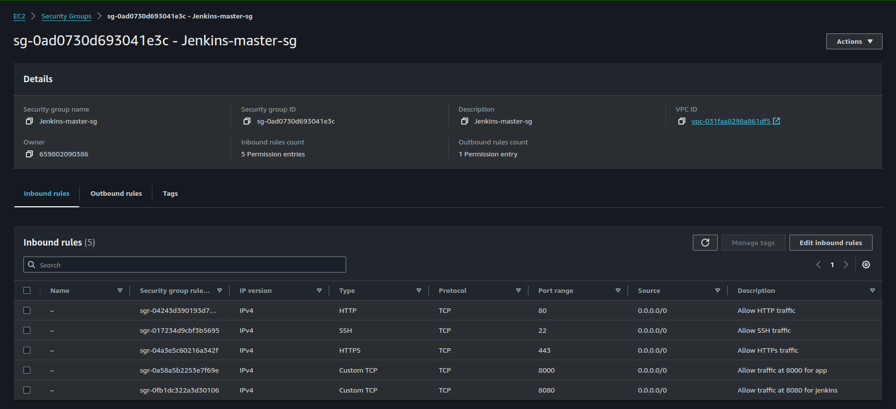
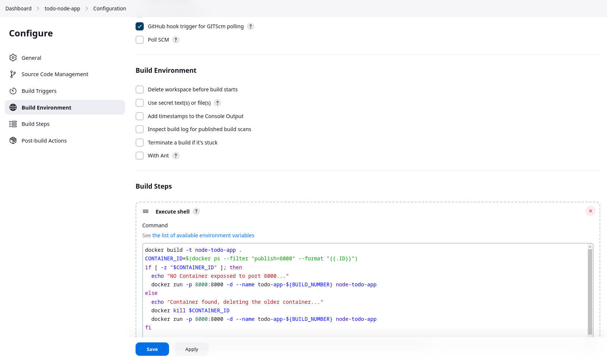

# Jenkins CICD for Node app

This project aims to establish a robust Continuous Integration and Continuous Deployment (CI/CD) pipeline for a ToDo Node.js application using Jenkins on AWS EC2. The pipeline will automate the processes of building, containerizing and deploying the application, ensuring that new features and updates are delivered quickly and reliably. By leveraging Jenkins, an open-source automation server, and AWS EC2, a scalable computing service, we will create a seamless and efficient workflow for our development and operations teams.

## Project Setup

1.  Setup EC2 instance for Jenkins master.

        EC2 Specs :
        - Jenkins Master
        - Unbuntu 22.04 LTS
        - t2.micro
        - security group with below mentioned inbound rules.

    

2.  Connect to instance via ssh & Setup the instance

    - Update the instance :
      `sudo apt update -y`
    - [Install jenkins](https://www.jenkins.io/doc/book/installing/linux/)
    - Install Docker :
      `sudo apt install docker.io -y`
    - Add docker permission to jenkins group : `sudo usermod -aG docker jenkins `
    - Restart Jenkins service : `sudo systemctl restart jenkins`

3.  Setup Jenkins & access at port 8080

    - cat the given directory and use the password to login into jenkins setup.
      

    - create a new item and select freestyle pipeline.
    - add the project url in Github Project section
    - select git as Source Code Management
    - Add credentials by creating ssh keys storing public in github & private in jenkins for repository access.
    - define branch to used : i.e **\*/main**
    - select GitHub hook trigger for GitSCM polling
    - Excute shell and define below commands for image building & container management.
      

4.  Setup github repository for Node application.

    - Fork the repository from [syash7202/todo-node-app](https://github.com/syash7202/Node-ToDo-App.git)
    - Add webhook from the repository setting.

      

          Add the Payload URL same as of your jenkins url & add "**/github-webhook/**" at end.

    - **Commit & the pipeline will trigger build & deployment.**

Route53 service can be setup if custom domain are available.

## Build Completion & App Images

